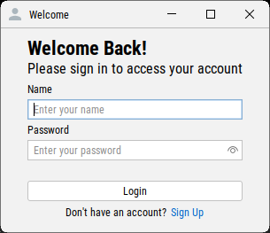
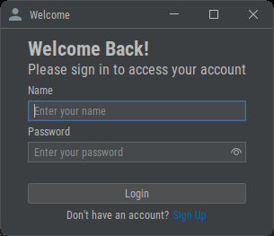
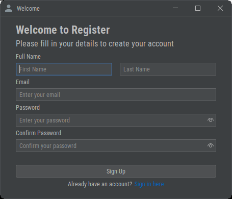

# Project login_register_ui

This is a modern and responsive user interface project for managing login and registration in Java Swing.

## Features

- Implementation of FlatLaf for a modern design.
- Full functionalities for login and registration.

## Installation

1. Clone this repository to your local machine:
   ```bash
   git clone https://github.com/swingcodelab/login_register_ui.git

## Screenshots





